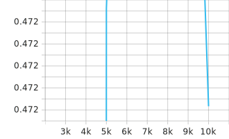
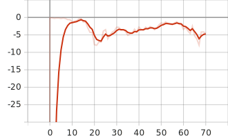

# sumo-marl
AI competition in traffic

## 环境配置
sumo-rl-main是环境依赖库，使用如下方法安装到虚拟环境内：
```
cd ./sumo-rl-main
pip install .
```
## 训练方法
arguments中放了参数说明，可以根据其调整参数直接运行，下面是一些常用训练命令:

```
python main.py --train_steps=5 --batch_size=16 --target_update_interval=350 --episode_limit=100 

python main.py --train_steps=7 --batch_size=32 --target_update_interval=300 --episode_limit=200
```
执行评估命令：
```
python main.py --evaluate
```

## 查看训练结果
训练结果都保存在results文件夹中,
- `Qi`表示第i个智能体Q值，
- `loss`loss函数，
- `Q_total`累积Q值，
- `Q_target`目标Q值，
- `evaluate_reward`表示评估奖励。

查看命令:
```
cd ./results
tensorboard --logdir .
```


